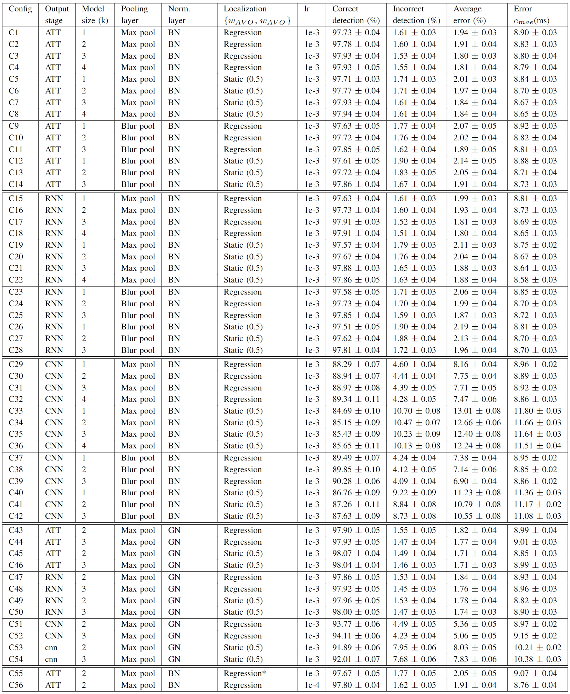
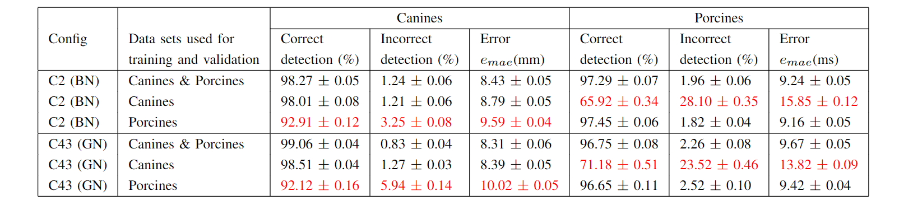

The article is sent for publication in the Journal of Biomedical and Health Informatics.

<!---
The article was published in the Journal of Biomedical and Health Informatics and is available 
[online](https://ieeexplore.ieee.org/document/9216477).

-->

## Supplementary Material

### Appendix A: Hyper-parameter sensitivity analysis

The importance of different hyper-parameters and the network structure were evaluated through an ablation study. To achieve a reliable result for each configuration, we performed nested cross-validation 50 times. Training each configuration multiple times was especially important as we found a significant variation in the performance from run to run. The need to train multiple networks for each configuration has limit the total number of hyper-parameter tested. Table B.1 shows the configurations evaluated.

The output from the attention module (ATT) yielded no improvement over the output from the RNN module. However, both showed a great improvement over the output from the CNN module. Larger model complexity through the increased value of *k* showed a slightly positive trend. The trend was consistent for each output stage (CNN, RNN, ATT), normalization layer, pooling layer, and localization head. Including data-driven localization head (&omega;AVO, &omega;AVC) did not result in superior performance compared to using static values (*&omega;AVO=0.5, &omega;AVC=0.5*) for the ATT and RNN output stages. The data-driven localization head showed enhanced performance in the output from the CNN stage. Hence, the data-driven localization head indicates to be a critical design parameter when the feature extractors are suboptimal (compare e.g. C29-C32 to C33-C36 in Table. B.1). We found 1e-4 to be a reasonable learning rate. C2 and C56 show a comparison between the learning rates 1e-3 and 1e-4. The overall performance was similar between batch normalization (BN) and group normalization (GN). Group normalization resulted typically in a lower *average error (%)*, where batch normalization gave a lower *error (ms)*. The choice of using a sigmoid activate function on the regression output is uncommon. However, we found it to improve the results. For comparison see C2 vs C55.

*Table B.1: The table shows the sensitivity of different hyper parameters. The results are calculated by averaging both the species: canines and porcines, and both the events: AVO and AVC. The values are given as &mu; &plusmn; &Delta;&mu;, where &mu; is the mean and &Delta;&mu; the uncertainty of the mean from 50 nested cross-validation runs with different seeds. BN: Batch normalization, GN: Group normalization, lr: Learning rate, MBP: Max Blur Pool, \*: Linear activation (no sigmoid). The definition of the average error is given in Equation [8]*

### Appendix B: Comparing results on canine and porcine data sets

We evaluated the similarity between the canine and porcine data sets by testing on the data set the network was not trained on. The results are shown in Table B.2 and we can draw the following conclusions:

* Training a single neural network on a mix of canine and porcine data result in a similar performance as training individual networks for each species.
* The canine data set include a significant overlap in the waveforms found in the porcine data set.
* Best performance on the canine data set is found using group normalization. 
* Best performance on the porcine data set is found using batch normalization. 

*Table B.2: The hyper-parameter configurations C2 and C43 can be found in Table B.1. The values colored red indicate results on a species the network was not trained for.*

