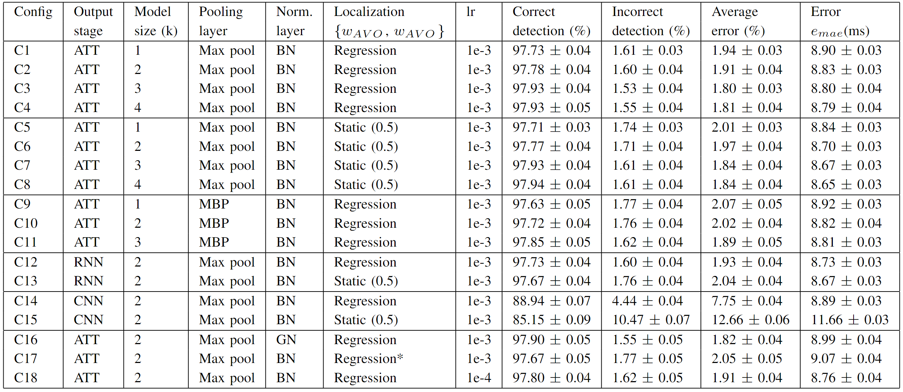

The article is sent for publication in the Journal of Biomedical and Healthcare Bioinformatics.

<!The article was published in the Journal of Biomedical and Healthcare Bioinformatics and is available 
[online](https://ieeexplore.ieee.org/document/9216477).>

## Supplementary Material

### Appendix A: Ablation study

A detailed description of all the Doppler measurement types referenced in the article is provided below. For full 
information on the relevant measurements as well as the referenced echocardiography (echo) views the reader is referred 
to the America Society of Echocardiography guidelines [1]. 

**Aortic Valve (AV)**: The aortic valve can be measured from either Apical 5 Chamber (A5C) or Apical Long Axis (APLAX). 
There are several measurements in the aortic valve region:

### Table

### Appendix B: Data set

The data ...

